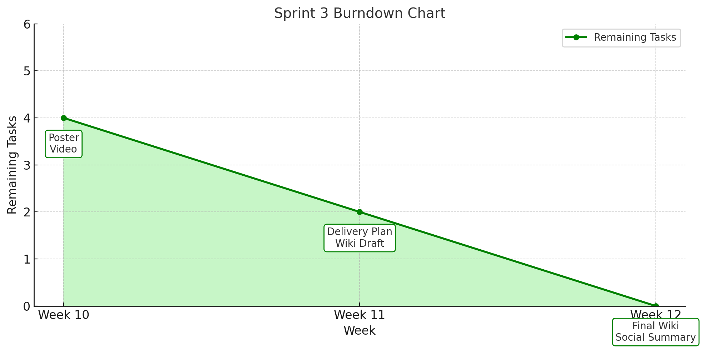

# 📘 Project Reflection Report

## 1️⃣ Response to Sprint 2 Tutor Feedback

| 🌟 Feedback Area              | ⚠️ Issue Identified                                                                 | 💡 Our Reflection                                                                                      | 🔧 Improvement Action                                                                                                                                         | 👥 Implemented By |
|------------------------------|-------------------------------------------------------------------------------------|--------------------------------------------------------------------------------------------------------|---------------------------------------------------------------------------------------------------------------------------------------------------------------|-------------------|
| **Personal Reflection Diary** | Reflections in Sprint 2 were mostly at the group level, lacking personal insights.  | Group-level reflections cannot fully capture individual experiences and growth.                        | Each member will submit a personal reflection on Wattle covering Sprints 1 to 3: what they learned, challenges faced, and how they plan to improve.           | All Members       |
| **Forward-looking Reflection**| Sprint 2 reflections focused on what was done, without evaluating or future planning. | Reflection should also identify problems and propose improvements for the next sprint.                | The reflection template was updated. After each task, members will assess whether problems occurred and suggest specific improvements for Sprint Planning.     | All Members       |

## 2️⃣ Sprint 3 Overview & Burndown Chart
### Sprint 3 Burn chart

### 🧠 Sprint 3 Task Reflections

| Task                           | ✅ What We Did                                                                                                                                                     | 💬 What We Thought                                                                                                                                                                               | 🔄 What We Improve (for future projects)                                                                                                                                                                                                                   |
|--------------------------------|-------------------------------------------------------------------------------------------------------------------------------------------------------------------|--------------------------------------------------------------------------------------------------------------------------------------------------------------------------------------------------|-------------------------------------------------------------------------------------------------------------------------------------------------------------------------------------------------------------------------------------------------------------|
| Handover Wiki Documentation    | Completed the structure planning, content writing, and formatting of the handover wiki on time. Covered key areas such as team intro, tools, and workflows.     | The document was clear and friendly in tone, but early-stage alignment on structure was lacking, leading to repeated revisions and extended discussions in the drafting phase.                   | In future projects, we should define documentation templates and structure earlier. Assign a document lead and implement a lightweight review cycle to reduce confusion and ensure consistent formatting and voice.                                       |
| Social Media Analysis Summary  | Used Metricool to collect and analyze data from six platforms. Created visual charts and a performance summary table. Identified primary/support/experimental roles. | TikTok, despite only 4 posts, contributed 92% of total impressions—highlighting the power of short-form video. Other platforms like Twitter and Facebook showed low ROI despite high activity. | Future projects should define strategic platform roles early. Establish a publish-review-adjust loop within each sprint. Implement a scheduling board and shared content library to ensure consistent cross-platform coordination and data-driven optimization. |
