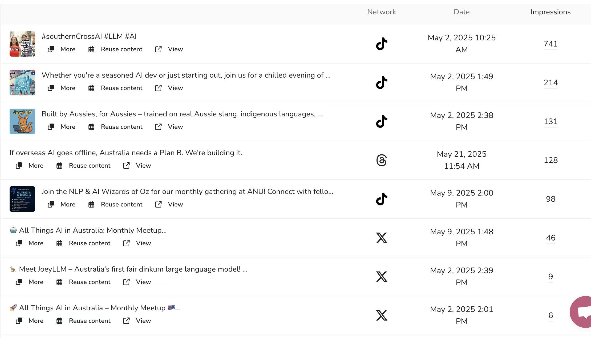

📊 Platform Performance Table

| Platform      | Impressions | Engagement | Posts | Follower Growth | Highlights / Performance Insights                                                                                   | **Future Improvement Directions (with Strategic Focus)**                                                                            |
| ------------- | ----------- | ---------- | ----- | --------------- | ------------------------------------------------------------------------------------------------------------------- | ----------------------------------------------------------------------------------------------------------------------------------- |
| **TikTok**    | 1,184       | 23         | 4     | +0              | Only 4 posts generated 92% of total impressions. May 2 post (#southernCrossAI) got 741 impressions & 22 engagements | 🔥 **Primary Platform**: Prioritize short-form video content, use trending hashtags, maintain consistent, high-quality video series |
| **Twitter**   | 78          | Not listed | 7     | +0              | Most posts among all platforms, but very low average impressions (some <10)                                         | ⚠️ **Support Platform**: Reduce post frequency, focus on higher-impact content and shareability                                     |
| **Instagram** | Not listed  | 3          | 6     | +3              | Gained followers, but weak engagement suggests low resonance in visuals or format                                   | ⚠️ **Support Platform**: Introduce Reels and use interactive stickers (polls, Q&A) to boost engagement                             |
| **Threads**   | 13          | 0          | 3     | +2              | One post got decent reach (128), but overall no engagement                                                          | 🧪 **Experimental Platform**: Test discussion-style posts and opinion pieces to encourage interaction                               |
| **Facebook**  | 0           | Not listed | 4     | +1              | No impressions or engagement despite content; likely a poor audience match                                          | 📎 **Content Sync Platform**: Maintain basic presence, use it to repost news or media mentions                                      |
| **YouTube**   | 5           | 0          | 1     | +1              | One video published, very low reach and zero engagement                                                             | 📎 **Content Sync Platform**: Consider using Shorts and behind-the-scenes formats to test engagement potential                      |
