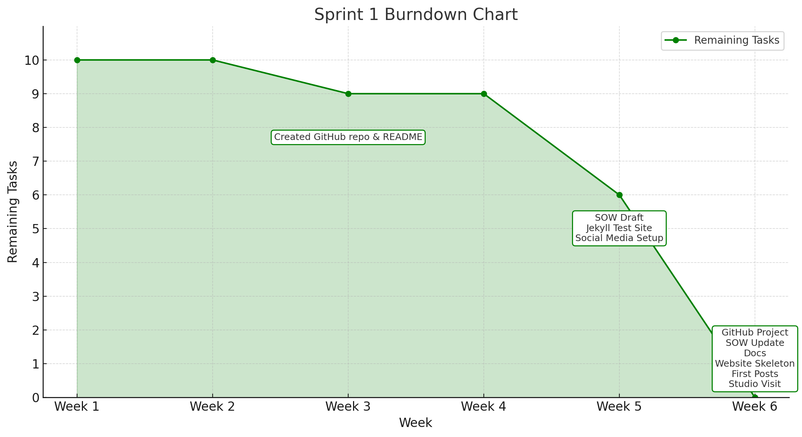

# 📘 Project Reflection Overview

This table summarizes the key challenges we encountered during our project, as well as the feedback and suggestions provided by our **tutor** and **client**. It also outlines how we responded and improved our workflow and documentation accordingly.

---

| 🌟 **Reflection Area** | 🧠 **Background** | ⚠️ **Problems Identified** | 🔧 **What We Improved** | ✅ **Outcome / Notes** | 👥 **Executor** |
|------------------------|------------------|-----------------------------|--------------------------|------------------------|--------------|
| **🛠 Workflow Management Enhancement** | - Last semester, our tutor mentioned the workflow was unclear. - The process of task discussion, assignment, and execution was not visible from outside. | - Workflow lacked transparency. - The process looked like a "black box" to our tutor — no visibility into how tasks were handled. | - Introduced **GitHub Projects** for end-to-end task tracking. - Documented each stage: discussion, assignment, progress, deadlines. - Enabled **real-time tracking** and agile adjustments. | Workflow is now fully transparent, traceable, and easy to review by external parties like the tutor. | 👨‍💻 Project Team |
| **📝 SOW Update** | - On **March 21st**, we completed our first draft of the Statement of Work (SOW). - Tutor emphasized the importance of **clear phase objectives** and **execution planning**. | - Phase objectives were too vague. - Lack of clarity on planning, task breakdown, and roles. | - Refined each phase’s objectives to be **clear and measurable**. - Added **detailed planning**, including task distribution, timelines, and responsibilities. - Included **milestone descriptions** for better tracking. | The revised SOW provides a more structured and practical foundation for team alignment and project execution. | 👩‍💼 Xuefei Luan |

---

## 🚀 Sprint 1: Setup Phase

| 🏁 **Main Objective** | 🔧 **Subtasks** |
|------------------------|----------------------------|
| **1. Team Setup & Documentation** | - Create GitHub repository and initialize README - Set up GitHub Project (Backlog, Milestones, Roadmap) - Draft and submit the initial Statement of Work (SOW) - Prepare the following project documentation:   ・Risk Management   ・Decision Log   ・Reflection Log   ・Meeting Record   ・Stakeholders Analysis   ・Team Charter   ・User Stories |
| **2. Website Skeleton Setup** | - Create a GitHub test repository and deploy a Jekyll test site - Build the basic structure (HTML/CSS/JS) of the Southern Cross AI website |
| **3. Social Media Setup** | - Register and bind accounts for 6 social media platforms (Facebook, Instagram, Twitter, LinkedIn, YouTube, TikTok) - Configure branding: logo, naming conventions, and connect to Metricool |
| **4. Initial Content Publishing** | - Publish one post on each platform as the first round of content testing |
| **5. Multimedia Studio Orientation** | - Visit the video and podcast studio to understand basic setup and equipment use |

---

## 📉 Sprint 1 Burndown Chart

